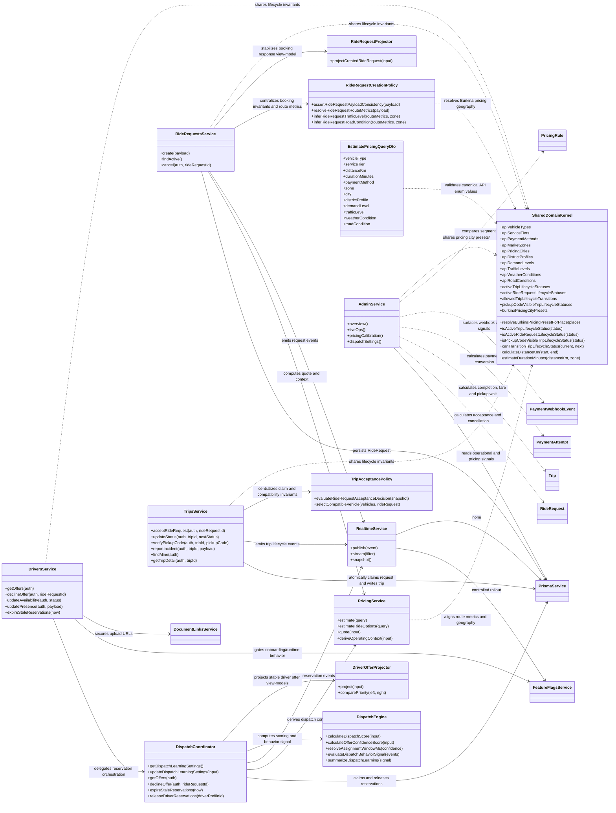

# Orbi Class Diagram

Ce diagramme couvre le coeur du contexte actuel de Orbi: identites, profils rider/driver, vehicules, demandes de course, trajets, pricing, wallets, notifications, support, audit et onboarding chauffeur securise.

Il est aligne sur le schema Prisma reel du repo au 27 avril 2026, y compris les briques transverses de session, tentative de paiement, configuration systeme et noyau domaine partage utilises par le dispatch, le pricing et l exploitation ops.

## Mermaid

```mermaid
classDiagram
direction LR

class User {
  +String id
  +String email
  +String phoneNumber
  +String passwordHash
  +String fullName
  +UserRole role
  +AuthProvider provider
  +Boolean isActive
  +Boolean isPhoneVerified
  +DateTime lastLoginAt
  +DateTime createdAt
  +DateTime updatedAt
}

class UserSession {
  +String id
  +String userId
  +String tokenHash
  +String userAgent
  +String ipAddress
  +DateTime createdAt
  +DateTime lastSeenAt
  +DateTime expiresAt
  +DateTime revokedAt
}

class RiderProfile {
  +String id
  +String userId
  +String emergencyPhone
  +ServiceTier preferredTier
}

class DriverProfile {
  +String id
  +String userId
  +String licenseNumber
  +VerificationStatus verificationStatus
  +DriverStatus status
  +Decimal currentLatitude
  +Decimal currentLongitude
  +Decimal serviceRadiusKm
  +Decimal averageRating
  +Int completedTripsCount
}

class DriverDocument {
  +String id
  +String driverProfileId
  +DriverDocumentType type
  +DriverDocumentStatus status
  +String fileName
  +String storageKey
  +String mimeType
  +DateTime uploadedAt
  +DateTime expiresAt
  +DateTime reviewedAt
  +String rejectionReason
  +Json metadata
  +String reviewedByUserId
}

class DriverOnboardingReview {
  +String id
  +String driverProfileId
  +DriverOnboardingReviewStatus status
  +String actorUserId
  +String notesInternal
  +String decisionReason
  +Json metadata
  +DateTime createdAt
}

class Vehicle {
  +String id
  +String driverId
  +String plateNumber
  +String make
  +String model
  +String color
  +Int year
  +VehicleType type
  +ServiceTier tier
  +Int seats
  +Boolean isActive
}

class SavedPlace {
  +String id
  +String riderId
  +String label
  +String address
  +Decimal latitude
  +Decimal longitude
}

class RideRequest {
  +String id
  +String riderId
  +RideRequestStatus status
  +String assignedDriverId
  +DateTime assignmentExpiresAt
  +VehicleType requestedVehicleType
  +ServiceTier requestedServiceTier
  +PricingCity pricingCity
  +DistrictProfile districtProfile
  +String pickupAddress
  +Decimal pickupLatitude
  +Decimal pickupLongitude
  +String destinationAddress
  +Decimal destinationLatitude
  +Decimal destinationLongitude
  +Decimal estimatedFare
  +Decimal estimatedDistanceKm
  +Int estimatedDurationMinutes
  +String currency
  +String notes
}

class PaymentAttempt {
  +String id
  +String userId
  +String rideRequestId
  +String idempotencyKey
  +String idempotencyHash
  +PaymentProvider provider
  +PaymentChannel channel
  +PaymentAttemptStatus status
  +Decimal amount
  +String currency
  +String mobileMoneyNetwork
  +String transactionRef
  +String providerReference
  +String customerPhoneNumber
  +String redirectUrl
  +Json providerMetadata
  +Json reconciliationPayload
  +String failureReason
  +DateTime createdAt
  +DateTime updatedAt
}

class PaymentWebhookEvent {
  +String id
  +PaymentProvider provider
  +String eventType
  +String transactionRef
  +String providerReference
  +String action
  +Int reconciledAttemptCount
  +Boolean signatureVerified
  +String rawBodyHash
  +Json payload
  +String paymentAttemptId
  +String userId
  +DateTime createdAt
}

class Trip {
  +String id
  +String rideRequestId
  +String riderId
  +String driverId
  +String vehicleId
  +TripStatus status
  +CancelledBy cancelledBy
  +DateTime startedAt
  +DateTime completedAt
  +String pickupAddress
  +String destinationAddress
  +Decimal actualFare
  +Decimal distanceKm
  +Int durationMinutes
  +String currency
}

class TripEvent {
  +String id
  +String tripId
  +String eventType
  +Json payload
}

class PricingRule {
  +String id
  +String name
  +VehicleType vehicleType
  +ServiceTier serviceTier
  +Decimal baseFare
  +Decimal perKmRate
  +Decimal perMinuteRate
  +Decimal bookingFee
  +Decimal minimumFare
  +Decimal surgeMultiplier
  +Int priority
  +Boolean isActive
}

class Wallet {
  +String id
  +String userId
  +String currency
  +Decimal balance
  +Boolean isLocked
}

class WalletTransaction {
  +String id
  +String walletId
  +WalletTransactionType type
  +Decimal amount
  +String reference
  +String description
  +Json metadata
}

class Rating {
  +String id
  +String tripId
  +String riderId
  +String driverId
  +Int score
  +String comment
}

class Notification {
  +String id
  +String userId
  +String title
  +String body
  +NotificationChannel channel
  +Boolean isRead
  +DateTime sentAt
}

class SupportTicket {
  +String id
  +String userId
  +String subject
  +String description
  +SupportTicketStatus status
  +Int priority
}

class AuditLog {
  +String id
  +String userId
  +String action
  +String entityType
  +String entityId
  +Json metadata
}

class SystemSetting {
  +String key
  +Json value
  +String updatedByUserId
  +String updatedByName
  +String updatedByRole
  +DateTime updatedAt
  +DateTime createdAt
}

User "1" --> "0..1" RiderProfile : has
User "1" --> "0..1" DriverProfile : has
User "1" --> "0..*" UserSession : authenticates with
User "1" --> "0..*" Wallet : owns
User "1" --> "0..*" PaymentAttempt : initiates
User "1" --> "0..*" Notification : receives
User "1" --> "0..*" SupportTicket : opens
User "1" --> "0..*" AuditLog : triggers

RiderProfile "1" --> "0..*" SavedPlace : saves
RiderProfile "1" --> "0..*" RideRequest : creates
RiderProfile "1" --> "0..*" Trip : takes
RiderProfile "1" --> "0..*" Rating : gives

DriverProfile "1" --> "0..*" Vehicle : drives
DriverProfile "1" --> "0..*" Trip : serves
DriverProfile "1" --> "0..*" Rating : receives
DriverProfile "1" --> "0..*" DriverDocument : owns
DriverProfile "1" --> "0..*" DriverOnboardingReview : tracks

RideRequest "1" --> "0..1" Trip : becomes
RideRequest "1" --> "0..*" PaymentAttempt : funds
PaymentAttempt "1" --> "0..*" PaymentWebhookEvent : audits callbacks
Trip "1" --> "1" Vehicle : uses
Trip "1" --> "0..*" TripEvent : logs
Trip "1" --> "0..*" Rating : collects

Wallet "1" --> "0..*" WalletTransaction : records
PricingRule ..> RideRequest : estimates
PricingRule ..> Trip : prices
RideRequest ..> PaymentAttempt : exposes payment conversion
PaymentWebhookEvent ..> PaymentAttempt : explains reconciliation
RideRequest ..> Trip : exposes pricing calibration
User "1" --> "0..*" DriverOnboardingReview : acts on
User "1" --> "0..*" DriverDocument : reviews
SystemSetting ..> AuditLog : is audited by
SystemSetting ..> RideRequest : configures dispatch behavior
```

## Service Layer Runtime Diagram

Ce second diagramme complete le modele de donnees avec la couche applicative qui porte la logique temps reel, le dispatch et les garanties de coherence. C est la vue la plus utile pour raisonner sur l architecture effective du backend, pas seulement sur le schema Prisma.

## Comment le diagramme guide le plan d'execution

- `User`, `RiderProfile`, `DriverProfile`, `Wallet` pilotent la Phase 2 sur l'authentification et les identites.
- `UserSession` porte la realite des sessions et la revocation, ce qui manque souvent dans les diagrammes trop simplifies.
- `RideRequest`, `PaymentAttempt`, `Trip`, `TripEvent`, `Vehicle`, `PricingRule` et `SystemSetting` pilotent les Phases 3 et 4 sur la reservation, le dispatch et le cycle de course.
- `Notification`, `SupportTicket`, `AuditLog`, `WalletTransaction`, `Rating`, `DriverDocument` et `DriverOnboardingReview` pilotent les Phases 6, 7 et 8 sur la confiance, l'exploitation et la robustesse.
- La voix ne remplace pas ce modele: elle alimente surtout la creation d'intentions de pickup/destination et enrichit `RideRequest`.
- `RideRequestsService`, `DriversService`, `TripsService`, `PricingService` et `RealtimeService` montrent ou vivent les invariants de concurrence, d idempotence et de diffusion live. C est essentiel pour raisonner sur une plateforme temps reel multi-acteurs.
- Le backend applique maintenant un invariant structurel supplementaire: un rider ne peut avoir qu une seule `RideRequest` active et un seul `Trip` actif a la fois, y compris sous concurrence, via transactions applicatives et index uniques partiels PostgreSQL.
- Les index uniques partiels qui portent cet invariant sont documentes dans `docs/architecture/data-invariants.md`, car Prisma ne peut pas les exprimer directement dans `schema.prisma`.
- Les applications rider et driver ne doivent plus re-decrire localement les memes etats critiques. Le noyau partage `packages/domain` porte maintenant la definition commune des statuts actifs et des transitions de trajet, afin d eviter la derive entre backend, apps Expo et documentation.
- Le backend contient aussi un test de contrat entre Prisma et `packages/domain` pour detecter toute divergence d enums ou de transitions avant build/deploiement.
- Les surfaces Expo encapsulent aussi leur projection locale dans des noyaux UI purs (`rider-active-flow`, `driver-active-flow`) pour garder la meme lecture metier entre cockpit, booking, activity, accueil, offres, revenus et profil sans dupliquer des derivations fragiles d etat live.
- La logique de dispatch n est plus concentree dans `DriversService`: `DispatchCoordinator` orchestre maintenant les reservations, expirations et signaux d apprentissage, `DispatchEngine` garde les regles pures de score et de confiance, et `DriverOfferProjector` stabilise la projection des offres chauffeur pour eviter de melanger orchestration et presentation API.
- L acceptation de course dans `TripsService` s appuie maintenant aussi sur `TripAcceptancePolicy` pour centraliser les regles pures de reservation active, reclamation apres expiration et compatibilite vehicule, ce qui rend les invariants de concurrence plus lisibles et plus testables.
- La creation de demande dans `RideRequestsService` suit la meme discipline: `RideRequestCreationPolicy` concentre la coherence payload/route/contexte, tandis que `RideRequestProjector` fige une reponse booking plus stable pour les apps rider et admin.

## Extensions prevues

Le modele est volontairement pret a recevoir ensuite:

- scheduled rides
- promo codes
- subscriptions
- fleet management
- delivery vertical
- paiement mobile local
- moderation, safety workflows et escalades operations
- stockage securise des justificatifs chauffeur
- revue ops explicite avec notes internes, decision et re-expiration documentaire
