# Mobilis Use Case Diagram

Ce diagramme visualise les cas d'utilisation coeur de Mobilis au 27 avril 2026. Il couvre les apps rider et driver, la console admin, les operations support, les services backend temps reel, le paiement et les workflows de confiance.

## Mermaid

```mermaid
flowchart LR
  Rider[Passager]
  Driver[Chauffeur]
  Admin[Admin]
  Ops[Ops]
  Support[Support]
  PaymentProvider[Fournisseur paiement]
  RealtimeClient[Client temps reel]
  DocumentStorage[Stockage documents]

  subgraph Mobilis["Plateforme Mobilis"]
    UCAuth((S'inscrire / se connecter))
    UCRestore((Restaurer une session))
    UCManagePlaces((Gerer lieux favoris))
    UCVoice((Interpreter un lieu vocal))
    UCQuote((Estimer prix et options))
    UCBook((Creer une demande))
    UCPay((Initialiser paiement))
    UCReconcilePayment((Reconcilier webhook paiement))
    UCCancelRequest((Annuler demande))
    UCTrackRider((Suivre demande / course))
    UCReportIncident((Signaler incident))

    UCOnboardDriver((Completer onboarding chauffeur))
    UCUploadDocs((Obtenir liens d'upload documents))
    UCSetPresence((Mettre a jour presence GPS))
    UCSetAvailability((Changer disponibilite))
    UCViewOffers((Voir offres compatibles))
    UCDeclineOffer((Refuser offre))
    UCAcceptOffer((Accepter demande))
    UCAdvanceTrip((Faire progresser course))
    UCVerifyPickup((Verifier code pickup))
    UCViewEarnings((Consulter revenus))

    UCAdminOverview((Voir overview operations))
    UCLiveOps((Superviser live ops))
    UCPricingCalibration((Analyser calibration pricing))
    UCPaymentWebhookJournal((Auditer webhooks paiement))
    UCInvestigatePayment((Ouvrir investigation paiement))
    UCDispatchSettings((Regler apprentissage dispatch))
    UCReviewDriver((Revoir onboarding chauffeur))
    UCReviewDocs((Approuver / rejeter documents))
    UCHandleSupport((Traiter tickets support))
    UCFeatureFlags((Piloter feature flags))
    UCHealth((Surveiller sante systeme))
    UCAudit((Auditer actions sensibles))

    UCRealtime((Diffuser evenements live))
    UCExpireReservations((Expirer reservations chauffeur))
    UCEnforceActiveFlow((Garantir un seul flux actif rider))
  end

  Rider --> UCAuth
  Rider --> UCRestore
  Rider --> UCManagePlaces
  Rider --> UCVoice
  Rider --> UCQuote
  Rider --> UCBook
  Rider --> UCPay
  Rider --> UCCancelRequest
  Rider --> UCTrackRider
  Rider --> UCReportIncident

  Driver --> UCAuth
  Driver --> UCRestore
  Driver --> UCOnboardDriver
  Driver --> UCUploadDocs
  Driver --> UCSetPresence
  Driver --> UCSetAvailability
  Driver --> UCViewOffers
  Driver --> UCDeclineOffer
  Driver --> UCAcceptOffer
  Driver --> UCAdvanceTrip
  Driver --> UCVerifyPickup
  Driver --> UCReportIncident
  Driver --> UCViewEarnings

  Admin --> UCAdminOverview
  Admin --> UCLiveOps
  Admin --> UCPricingCalibration
  Admin --> UCPaymentWebhookJournal
  Admin --> UCInvestigatePayment
  Admin --> UCDispatchSettings
  Admin --> UCReviewDriver
  Admin --> UCReviewDocs
  Admin --> UCFeatureFlags
  Admin --> UCHealth
  Admin --> UCAudit

  Ops --> UCLiveOps
  Ops --> UCDispatchSettings
  Ops --> UCPricingCalibration
  Ops --> UCPaymentWebhookJournal
  Ops --> UCInvestigatePayment
  Ops --> UCHealth

  Support --> UCPaymentWebhookJournal
  Support --> UCInvestigatePayment

  Support --> UCHandleSupport
  Support --> UCReportIncident
  Support --> UCReviewDriver

  UCPay --> PaymentProvider
  PaymentProvider --> UCReconcilePayment
  UCUploadDocs --> DocumentStorage
  UCReviewDocs --> DocumentStorage
  UCTrackRider --> RealtimeClient
  UCViewOffers --> RealtimeClient
  UCLiveOps --> RealtimeClient

  UCBook -. includes .-> UCQuote
  UCBook -. includes .-> UCEnforceActiveFlow
  UCAcceptOffer -. includes .-> UCEnforceActiveFlow
  UCAcceptOffer -. includes .-> UCRealtime
  UCReconcilePayment -. includes .-> UCAudit
  UCInvestigatePayment -. includes .-> UCAudit
  UCInvestigatePayment -. includes .-> UCHandleSupport
  UCAdvanceTrip -. includes .-> UCRealtime
  UCCancelRequest -. includes .-> UCRealtime
  UCDeclineOffer -. includes .-> UCExpireReservations
  UCViewOffers -. includes .-> UCExpireReservations
  UCReviewDriver -. includes .-> UCAudit
  UCReviewDocs -. includes .-> UCAudit
  UCDispatchSettings -. includes .-> UCAudit
  UCHandleSupport -. includes .-> UCAudit
```

## Invariants Metier

- Un passager ne peut avoir qu'une seule demande active ou course active a la fois.
- Un chauffeur ne recoit que des offres compatibles avec son statut, sa verification, son rayon de service, ses vehicules actifs et la reservation courante.
- Le code pickup est visible uniquement avant le demarrage effectif de la course.
- Le pricing Burkina partage les memes villes, profils de districts, zones, conditions de route, trafic et meteo entre backend, API et apps clientes.
- Les webhooks paiement verifient la signature fournisseur quand elle est configuree, reconcilient idempotemment par `providerReference` et journalisent chaque notification traitee.
- Les actions admin sensibles produisent des traces d'audit et peuvent ouvrir un ticket support quand l'onboarding chauffeur est bloque.
